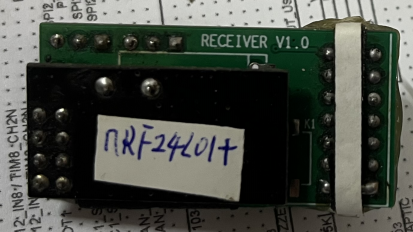
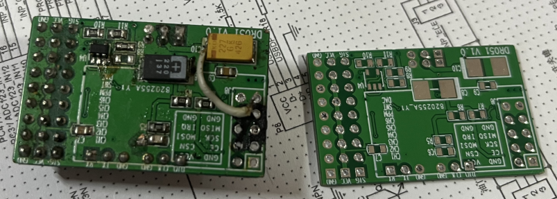

# 介绍

本接收器用于配合 Deviation-Transmitter 使用：

- Deviation-Transmitter遥控器硬件参考：https://github.com/psbec/Deviation-TransmitterHardware
- Deviation-Transmitter遥控器软件参考：https://github.com/psbec/Deviation-Transmitter

这里做了两个版本的接收器：

- 基于STM32F030：此接收器可接收6个通道的数据，输出标准的PWM数据；
- 基于STM32F051：输出6通道数据+一路DAC数据，同时还可以将接收端的电压返回给遥控器。

# 硬件设计

## STM32F030接收器

电路比较简单，下面一张图就够了：

## STM32F051接收器

与F030方案相比，增加了输入电压采样和DAC输出：

DAC输出通道可以根据需要调整电阻值，计算公式在电路图中有描述。

# 实物图

F030方案实物图，PCB做错了，PWM信号线从左到右应当是 GND 、VCC、SIG，结果画PCB时做成了 VCC、GND、SIG，下图中的PCB经过了改装：

PCB背面焊接了nfr24L01模块：

下面是F051方案的背面图（左板的nrf24L01模块未焊接）：

